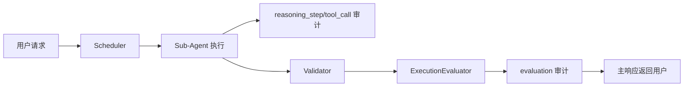

# Agent 在线评估与执行可观测方案

## 目标与背景

当前 KubeMin-Agent 已具备调度、校验与审计能力，但缺少面向“每次执行质量”的统一评估机制。每次 Agent prompt、工具集或调度策略调整后，难以量化对执行质量的影响，形成黑盒优化。

本方案目标:
- 为每一次任务执行生成可观测的结构化执行轨迹
- 在线产出质量评分，支持低分告警
- 不暴露完整思维链，仅记录可解释的结构化推理摘要

## 设计原则

- 可观测优先: 所有评估输入必须可追溯到审计事件
- 稳定优先: 规则评分作为基线，LLM 评分作为补充
- 安全优先: 禁止落盘完整 CoT，仅保留结构化摘要
- 低侵入上线: 评估结果默认只告警，不阻断用户主流程

## 架构与数据流

执行链路:
1. Scheduler 分派任务
2. BaseAgent 在工具调用过程中记录 `reasoning_step`
3. Validator 进行安全与质量基础校验
4. ExecutionEvaluator 汇总执行轨迹 + 输出 + 校验结果做在线评分
5. AuditLog 记录 `evaluation` 事件
6. 主流程返回结果（不阻断）

## 接口定义

### 配置

新增 `Config.evaluation`:

- `enabled: bool = True` -- 是否开启评估
- `mode: str = "online"` -- 评估模式（当前仅 online）
- `warn_threshold: int = 60` -- 告警阈值
- `llm_judge_enabled: bool = True` -- 是否启用 LLM 语义裁判
- `trace_capture: bool = True` -- 是否采集结构化执行轨迹
- `max_trace_steps: int = 50` -- 单任务最大轨迹步数

### 审计事件 schema

#### reasoning_step

- `type: "reasoning_step"`
- `request_id: str`
- `session_key: str`
- `agent_name: str`
- `task_id: str`
- `step_index: int`
- `phase: str` (`plan`/`tool_call`/`tool_observation`/`synthesis`)
- `intent_summary: str`
- `action: str`
- `observation_summary: str`
- `confidence: float | None`
- `error: str`

#### evaluation

- `type: "evaluation"`
- `request_id: str`
- `session_key: str`
- `agent_name: str`
- `task_id: str`
- `overall_score: int`
- `dimension_scores: dict[str, int]`
- `passed: bool`
- `warn_threshold: int`
- `reasons: list[str]`
- `suggestions: list[str]`

## 评分策略

### 规则评分（基线）

维度:
- `completeness`: 输出非空、有效长度、是否包含结果性描述
- `execution_health`: 工具调用失败率、是否触发 validator block/warn
- `efficiency`: 工具调用次数、重复调用密度

输出 `rule_score`（0-100）。

### LLM 语义评分（补充）

输入:
- 任务描述
- 最终输出
- reasoning_step 摘要
- validator 结果

输出 JSON:
- `correctness`
- `relevance`
- `actionability`
- `reasons`

失败回退:
- LLM 调用失败/JSON 不合法时自动回退纯规则评分

### 混合合成

- `overall = 0.6 * rule_score + 0.4 * llm_score`
- `overall < warn_threshold` 时 `passed = False`
- 仅写审计告警，不阻断响应

## 影响范围与风险评估

影响范围:
- `control/runtime.py` 运行时装配
- `control/scheduler.py` 任务执行链路
- `agents/base.py` 执行轨迹采集
- `control/audit.py` 新增审计事件
- `config/schema.py` 新增配置
- `cli/commands.py` 新增状态展示

主要风险与缓解:
- 日志量增长: 通过 `max_trace_steps` + 文本 preview 截断
- LLM 评分波动: 规则分兜底，LLM 失败自动回退
- 过程泄露风险: 只记录结构化摘要，不记录完整 CoT 原文

## 验证计划

单元测试:
- `test_evaluation.py`: 规则分、LLM 回退、混合分计算
- `test_audit.py`: `reasoning_step/evaluation` 事件字段

集成测试:
- `test_scheduler.py`: 执行后写入 `evaluation`，低分仅告警不阻断
- `test_runtime.py`: runtime 从 config 启用评估器

验收标准:
- 任意 request_id 可追踪到 dispatch -> tool_call/reasoning_step -> validation -> evaluation
- 低分任务生成可读原因与建议
- 主流程行为不变（无阻断）

## 变更日志

| 日期 | 变更 | 原因 |
|------|------|------|
| 2026-02-27 | 新增在线评估与执行可观测方案 | 解决 Agent 调整黑盒问题, 提供可量化评估 |
