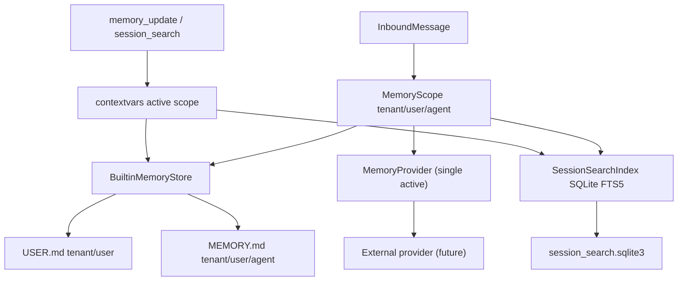

# 多租户记忆系统架构文档

## 设计理念

KubeMin-Agent 的记忆系统采用 Hermes Agent 的三层思路：短小高信号的内置记忆、大容量会话搜索、可插拔外部 MemoryProvider。系统从第一版开始面向多租户、多用户，任何记忆读写都必须显式绑定 `tenant_id` 与 `user_id`，避免不同用户、租户、Agent 之间发生上下文泄漏。

核心原则：

- `USER.md` 保存用户偏好和沟通习惯，按 `tenant_id + user_id` 共享。
- `MEMORY.md` 保存 Agent 专业长期记忆，按 `tenant_id + user_id + agent_name` 分域。
- 会话历史进入 SQLite FTS5 索引，按需检索，不常驻 prompt。
- 外部 provider 通过接口扩展，V1 只允许一个 active provider，默认 `none`。
- 记忆是辅助上下文，不是实时状态。涉及集群、工作流、生产操作前必须重新调用工具验证。

## 架构

## 功能清单

| 功能 | 状态 |
|---|---|
| `MemoryScope(tenant_id, user_id, agent_name)` | 已实现 |
| `USER.md` 按租户和用户隔离 | 已实现 |
| `MEMORY.md` 按租户、用户、Agent 隔离 | 已实现 |
| `add/replace/remove` 内置记忆操作 | 已实现 |
| 重复记忆幂等 | 已实现 |
| 硬字符上限与 80% 整理提醒 | 已实现 |
| prompt injection、凭据、控制字符安全扫描 | 已实现 |
| SQLite FTS5 会话搜索 | 已实现 |
| scoped `memory_update` / `session_search` 工具 | 已实现 |
| 外部 `MemoryProvider` 抽象 | 已实现 |
| Honcho/Mem0/Supermemory 适配器 | 规划中 |

## 安全约束

- 工具不能从模型参数接收 `tenant_id`、`user_id`、`agent_name`，只能读取运行时 `MemoryScope`。
- 记忆写入必须通过安全扫描；命中风险内容时 fail-fast，不静默保存。
- FTS 查询必须按 `tenant_id + user_id` 强制过滤，不能跨租户或跨用户召回。
- `USER.md` 与 `MEMORY.md` 有硬字符上限，超过上限直接失败。
- 当前集群状态不得作为长期记忆直接信任，操作前必须重新查询工具。

## 工具集

- `memory_update`
  - `target`: `user` 或 `memory`
  - `action`: `add`、`replace`、`remove`
  - `content`: 新增或替换内容
  - `old_text`: 替换或删除时的唯一匹配子串
- `session_search`
  - `query`: 搜索词
  - `top_k`: 返回数量
  - `agent_name/session_key/request_id`: 可选过滤条件

## 技术取舍

- 使用 Markdown 保存短记忆：可审计、可手工修正、适合 docs-first；不适合作为大容量历史库。
- 使用 SQLite FTS5 保存会话搜索：无外部依赖、可本地部署、强作用域过滤；语义搜索可后续通过 provider 扩展。
- 使用 `contextvars` 传递工具 scope：避免模型伪造租户或用户 ID。
- V1 不接外部 provider：先稳定本地契约，再接 Honcho、Mem0、Supermemory 等服务。

## 变更日志

| 日期 | 变更 | 原因 |
|---|---|---|
| 2026-05-12 | 新增 Hermes 风格多租户三层记忆系统 | 从新项目基线开始搭建记忆模块 |
