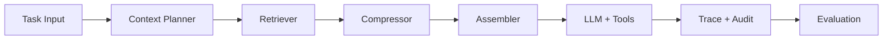

# 上下文工程设计与演进路线 (Context Engineering)

## 1. 文档目的

本文档定义 KubeMin-Agent 的上下文工程基线、当前实现状态、关键缺口与分阶段演进计划，目标是将 Agent 执行从"黑盒调参"升级为"可观测、可评估、可回归"的工程体系。

适用范围:
- 控制面主链路: `ControlPlaneRuntime -> Scheduler -> SubAgent`
- 兼容链路: `AgentLoop` (legacy)
- 上下文相关组件: `ContextBuilder`、`SessionManager`、`MemoryStore`、工具结果、审计与评估

---

## 2. 核心问题定义

上下文工程的本质是: 在有限上下文窗口内，最大化模型决策质量与执行稳定性。

当前主要矛盾:
- 信息来源持续增长: system prompt、会话历史、工具返回、记忆、技能、外部文档
- 模型窗口有限且位置敏感: 前后文权重并不均匀
- 多 Agent 调度增加了上下文传递与隔离复杂度
- 没有严格预算与质量闭环时，优化容易退化为经验性调参

---

## 3. 设计原则

1. **任务优先**: 仅注入与当前任务直接相关的信息。
2. **预算优先**: 任何上下文都必须受 token 预算约束。
3. **结构优先**: 工具原始输出优先结构化、摘要化后再入上下文。
4. **隔离优先**: 外部内容默认为数据，不可提升为高优先级指令。
5. **可观测优先**: 每轮执行的关键上下文决策必须可追踪。
6. **评估闭环**: 通过在线评分与审计数据验证上下文策略有效性。

---

## 4. 当前实现基线 (As-Is, 2026-02-27)

### 4.1 链路现状

| 执行链路 | 状态 | 上下文构建方式 |
|---|---|---|
| 控制面主链路 (`control/runtime.py`) | 默认启用 | 子 Agent 直接使用 `system_prompt + history[-10:] + current_message` |
| 兼容链路 (`agent/loop.py`) | 保留 | 使用 `ContextBuilder.build_messages()` 组装上下文 |

结论:
- 当前生产主路径并未统一走 `ContextBuilder`，上下文策略在两条链路上存在实现分叉。

### 4.2 上下文来源与处理策略

| 信息类型 | 当前行为 | 代码位置 |
|---|---|---|
| System Prompt | 每个子 Agent 固定 prompt | `kubemin_agent/agents/*.py` |
| 对话历史 | 固定滑窗 `history[-10:]` | `kubemin_agent/agents/base.py` |
| 记忆 | `MemoryStore.get_context(top_k=5)` | `kubemin_agent/agent/context.py`, `agent/memory/store.py` |
| Skills | always skill 全量 + 其他摘要 | `kubemin_agent/agent/skills.py` |
| Browser snapshot | 4000 字符截断 | `kubemin_agent/agent/tools/browser.py` |
| Content audit text/console | 1000 字符预览截断 | `kubemin_agent/agent/tools/content_audit.py` |

### 4.3 观测与评估能力

已完成能力:
- `AuditLog` 记录 `dispatch/execution/validation/tool_call`
- 新增 `reasoning_step` 结构化执行轨迹 (非完整 CoT)
- 新增 `evaluation` 在线评分事件 (规则 + LLM 混合)
- 评分策略默认为低分告警，不阻断主流程

关键实现:
- 轨迹采集: `kubemin_agent/agents/base.py`
- 在线评估: `kubemin_agent/control/evaluation.py`
- 评估接入: `kubemin_agent/control/scheduler.py`, `control/runtime.py`
- 配置入口: `Config.evaluation` (`kubemin_agent/config/schema.py`)

---

## 5. 差距分析 (Gap Analysis)

### 5.1 已落地 vs 待建设

| 能力项 | 状态 | 说明 |
|---|---|---|
| 执行可观测 (reasoning_step) | 已实现 | 结构化步骤可追踪 |
| 在线质量评估 (evaluation) | 已实现 | 规则分 + LLM 语义分 |
| 上下文动态预算 | 已实现(核心) | 控制面子 Agent 已改为 token 预算裁剪历史，不再固定 10 轮 |
| 工具结果摘要层 | 未实现 | 主要依赖硬截断，信息损失不可控 |
| 跨 Agent 共享上下文对象 | 未实现 | 任务传递仍以纯文本为主 |
| 基准集回放评测 | 未实现 | 暂无标准化离线回归集 |

### 5.2 主要技术债

1. **上下文策略分叉**: 主链路与 `ContextBuilder` 双轨并存，策略难统一演进。
2. **缺少预算编排器**: 无统一 token 预算分配逻辑，复杂任务稳定性风险高。
3. **压缩策略偏静态**: 以字符截断为主，缺少语义保真摘要。
4. **跨 Agent 上下文弱耦合**: 多任务编排时共享信息复用不足。

---

## 6. 目标架构 (To-Be)

### 6.1 上下文流水线

模块职责:
- **Context Planner**: 依据模型窗口与任务复杂度分配预算
- **Retriever**: 从历史/记忆/外部信息中筛选相关上下文
- **Compressor**: 对工具结果与冗余上下文做结构化摘要
- **Assembler**: 按优先级和预算拼装最终消息
- **Trace + Evaluation**: 形成质量闭环并驱动持续优化

### 6.2 统一上下文契约

建议引入统一数据对象 `ContextEnvelope` (后续实现):
- `task_summary`: 任务摘要
- `hard_constraints`: 不可违背约束 (安全/策略)
- `relevant_history`: 相关历史片段
- `retrieved_memory`: 检索记忆
- `tool_findings`: 结构化工具发现
- `budget_report`: token 预算分配与消耗

目标: 控制面主链路与 legacy 链路复用同一上下文装配规范。

---

## 7. 分阶段实施计划

### M1 (已完成): 执行可观测与在线评估

交付:
- `reasoning_step` 结构化轨迹
- `evaluation` 评分事件
- `Config.evaluation` 配置化开关

验收:
- 可按 `request_id` 串联 `dispatch -> tool_call/reasoning_step -> validation -> evaluation`
- 低分任务仅告警，不影响主响应

### M2 (P0, 已完成核心能力): 动态上下文预算

目标:
- 替代固定 `history[-10:]`，按 token 预算动态分配历史容量

实施结果:
- `kubemin_agent/agents/base.py`: 已接入预算器，不再硬编码窗口
- `kubemin_agent/control/runtime.py`: 已将预算参数从配置注入子 Agent

验收:
- 任意请求均输出预算报告 (可通过 debug log 或 audit 附加字段)
- 上下文溢出率显著降低

当前落地范围:
- `BaseAgent.run()` 已由固定 `history[-10:]` 改为 token 预算裁剪
- 新增任务锚点 (`TASK ANCHOR`) 与每轮提醒 (`TASK REMINDER`) 以降低长任务目标漂移
- 上述预算参数已配置化并由 `ControlPlaneRuntime.from_config()` 注入默认子 Agent

剩余项:
- `kubemin_agent/agent/context.py` 与 `kubemin_agent/agent/loop.py` 尚未并入同一预算策略（兼容链路后续收敛）

### M3 (P1): 工具结果语义摘要层

目标:
- 对 snapshot/network/console 等大输出先摘要再入上下文

拟改动:
- 新增 `agent/tools/summarizer.py`
- 集成至 `browser.py`、`content_audit.py`

验收:
- 上下文长度下降且关键错误信息召回不下降

### M4 (P1): 跨 Agent 上下文传递

目标:
- 多任务编排时共享中间发现，减少重复探索

拟改动:
- `control/agent_context.py` (新)
- `control/scheduler.py`、`agents/base.py`

验收:
- 依赖任务能复用前序任务发现，不重复工具调用

### M5 (P1): 记忆检索策略升级

目标:
- `MemoryStore` 从“默认列举”升级为“查询驱动检索优先”

拟改动:
- `agent/memory/store.py`、`agent/context.py`
- 后端策略与配置项联动 (`file/jsonl/chroma`)

验收:
- 相关记忆命中率提升，prompt 体积可控

### M6 (P2): 离线基准与回归评测

目标:
- 构建固定任务集，支持版本间上下文策略回归对比

拟改动:
- `eval/` 目录 (数据集 + 评测脚本) 与 CLI 入口

验收:
- 每次上下文策略变更可输出可比对分数与回归报告

---

## 8. 指标体系与SLO建议

### 8.1 运行指标

- `context_prompt_tokens_p95`
- `context_overflow_rate`
- `tool_result_compression_ratio`
- `trace_step_count_p95`

### 8.2 质量指标

- `evaluation_overall_score_p50/p95`
- `low_score_rate` (`overall < warn_threshold`)
- `validation_block_rate`
- `task_success_rate`

### 8.3 稳定性指标

- `agent_iteration_exhaust_rate` (达到 MAX_ITERATIONS 的比例)
- `tool_error_rate`
- `fallback_to_general_rate`

---

## 9. 风险与治理

| 风险 | 影响 | 缓解策略 |
|---|---|---|
| 轨迹日志膨胀 | 存储与检索成本上升 | `max_trace_steps` + preview 截断 + 生命周期清理 |
| LLM 裁判波动 | 评分稳定性下降 | 规则分兜底 + 低温度 + 结果回退策略 |
| 上下文策略分叉长期存在 | 维护复杂度上升 | 在 M2 统一 Context Planner 接口 |
| 过度压缩导致信息丢失 | 任务质量下降 | 摘要前后 A/B 对比与关键字段白名单 |

---

## 10. 与现有文档关系

- 评估与可观测详细方案: `docs/agent-evaluation-observability-plan.md`
- 总体架构与实施计划: `docs/design-and-implementation-plan.md`
- 各子 Agent 架构文档: `docs/arch-*.md`

本文件聚焦上下文工程视角，负责串联"上下文构建 -> 执行 -> 观测 -> 评估"全链路。

---

## 11. 变更日志

| 日期 | 变更 | 原因 |
|---|---|---|
| 2026-02-27 | M2 核心能力落地: 控制面子 Agent 接入动态上下文预算与任务锚点 | 解决长任务目标漂移与固定 10 轮窗口问题 |
| 2026-02-27 | 重构文档为专业版上下文工程设计与路线图，纳入在线评估与可观测能力 | 对齐当前实现，提供可执行演进计划 |
