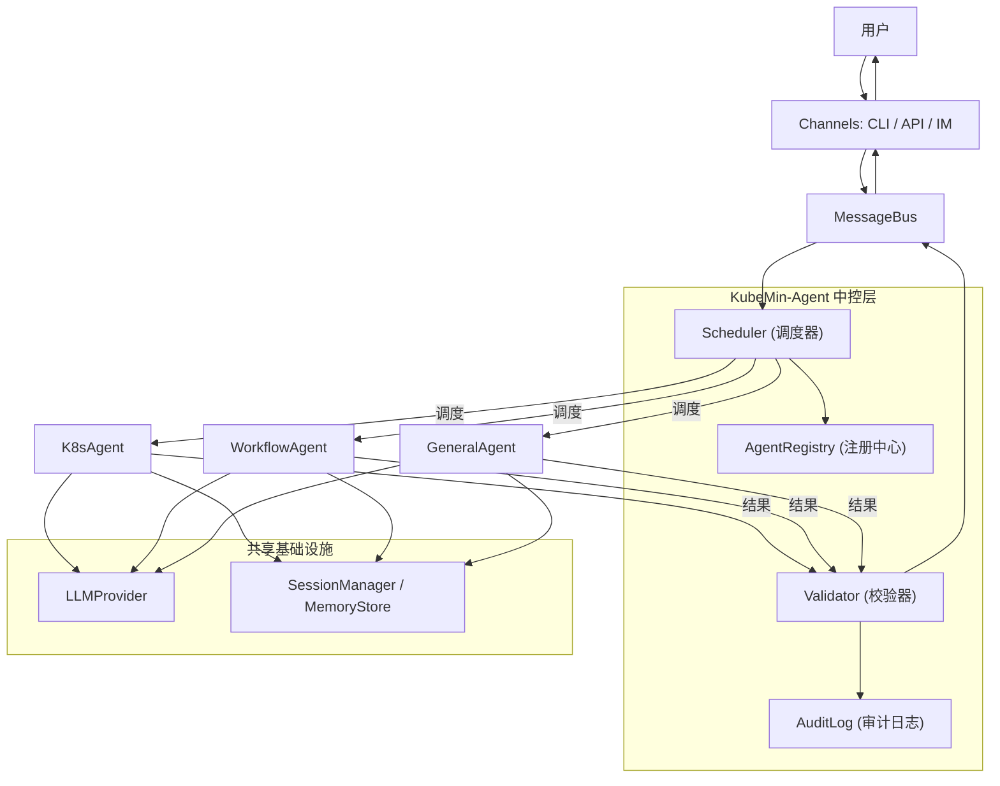

# KubeMin-Agent 设计文档与实现计划

> KubeMin-Agent 是 KubeMin 体系的 Agent 中台中控，统一管理和调度所有子 Agent。

---

## 0. 实现状态更新（2026-02-26）

本次更新聚焦“中控链路落地”，将运行入口从单一 `AgentLoop` 默认模式升级为可直接使用控制面调度链路。

### 0.1 当前实现范围

- 新增 `ControlPlaneRuntime` 作为运行时装配层，统一组装：
  - `AgentRegistry`
  - `Scheduler`
  - `Validator`
  - `AuditLog`
  - `SessionManager`
- CLI `agent` 与 `gateway` 默认走中控调度链路：
  - `user message -> Scheduler -> SubAgent -> Validator -> Audit -> response`
- `Scheduler` 支持多任务编排：
  - `sequential` 顺序执行
  - `parallel` 并发执行
  - `depends_on` 依赖约束（无环 DAG）
- `Validator` 升级为分层校验能力：
  - 安全模式拦截
  - 输出质量校验
  - 基础敏感信息脱敏（API key / token / bearer）
  - `ValidationResult` 增加 `severity / policy_id / redactions`
- `AuditLog` 增加 `request_id` 贯穿，补充工具调用日志接口

### 0.2 与原计划差异说明

- `AgentLoop` 保留为兼容能力，不再作为默认中控执行主链路。
- `GeneralAgent/K8sAgent/WorkflowAgent` 的专属工具仍为分阶段建设，当前优先完成调度与管控主链路。

### 0.3 下一步（与 M3-M6 对齐）

- 端到端复杂协作流 (Multi-Agent Orchestration) 测试
- 打通 Cron / Heartbeat 到统一控制面入口

### 0.4 增量更新（2026-02-27）

新增“在线评估与执行可观测”能力（详见 `docs/agent-evaluation-observability-plan.md`）:

- 引入 `ExecutionEvaluator` 进行任务执行质量在线评分（规则 + LLM 混合）
- 运行链路新增 `reasoning_step` 结构化轨迹事件（不记录完整 CoT）
- 审计新增 `evaluation` 事件，记录总分、维度分、原因与改进建议
- 默认策略为“仅观测告警，不阻断主流程响应”

### 0.5 增量更新（2026-02-28）

优先执行上下文工程阶段 C（M3-M5），完成以下核心能力：

- 工具结果语义摘要层：
  - 新增 `agent/tools/summarizer.py`
  - `BrowserTool` 与 `ContentAuditTool` 的大输出路径接入语义摘要，降低纯截断带来的关键信息丢失
- 跨 Agent 上下文传递：
  - 新增 `control/agent_context.py`（`ContextEnvelope` + `AgentContextStore`）
  - `Scheduler` 在多任务依赖链路中将前序任务发现传递给后续任务
  - `BaseAgent.run()` 支持注入 `context_envelope`，减少重复探索
- 查询驱动记忆注入：
  - `BaseAgent` 改为按当前任务 query 召回 memory 并注入 prompt
  - 新增配置联动：`memory_backend` / `memory_top_k` / `memory_context_max_chars`
  - `ControlPlaneRuntime.from_config()` 已将记忆策略下发到默认子 Agent

---

## 1. 项目定位与目标

**KubeMin-Agent** 是 KubeMin 体系的 **Agent 中台中控**（Agent Control Plane）。它不是某一个具体的 Agent，而是整个 Agent 生态系统的管理层和运行底座，负责：

- **子 Agent 全生命周期管理** -- 注册、发现、启停、健康检查
- **智能任务调度** -- 接收用户请求，分析意图，将任务调度到最合适的子 Agent
- **执行校验与质量管控** -- 校验子 Agent 输出，拦截不安全操作，审计所有执行
- **上下文与记忆管理** -- 为所有子 Agent 提供统一的会话、记忆和配置基础设施
- **多通道统一接入** -- CLI、API、即时通讯（Telegram/飞书/钉钉）

### KubeMin 体系全景

```
KubeMin 体系
├── KubeMin-Console    -- 前端控制台（Web UI）
├── KubeMin-Cli        -- 命令行工具
├── KubeMin-Agent      -- Agent 中台中控（本项目）
│   ├── K8sAgent       -- K8s 运维子 Agent
│   ├── WorkflowAgent  -- 工作流编排子 Agent
│   ├── GeneralAgent   -- 通用任务子 Agent
│   └── ...            -- 未来可扩展更多子 Agent
└── KubeMin-Platform   -- 后端平台服务
```

### 核心差异（对比 nanobot）

| 维度 | nanobot | KubeMin-Agent |
|------|---------|---------------|
| 定位 | 单体个人 AI 助手 | Agent 中台中控（管理多个子 Agent） |
| 架构 | 单 AgentLoop | 中控调度层 + 受管子 Agent |
| 关注点 | 自身执行能力 | 子 Agent 的调度、校验、管控 |
| 工具集 | 文件/Shell/Web/消息 | 按子 Agent 隔离（K8s/Workflow/通用） |
| 安全模型 | 正则拦截 + 工作区限制 | 中控层统一校验 + RBAC + 审计 |
| 扩展性 | 新增 Tool | 新增整个子 Agent |
| 部署 | 单机单进程 | 可嵌入 KubeMin 平台或独立部署 |

---

## 2. 高层架构

### 2.1 中台中控架构



### 2.2 中控层核心职责

| 组件 | 职责 |
|------|------|
| **Scheduler（调度器）** | 接收消息 -> 意图分析 -> 选择子 Agent -> 分派任务（含拆分和编排） |
| **Validator（校验器）** | 校验子 Agent 输出的合规性、安全性；拦截不允许的操作 |
| **AgentRegistry（注册中心）** | 子 Agent 注册、发现、健康状态、能力描述 |
| **AuditLog（审计日志）** | 记录所有调度决策、Agent 执行和工具调用 |

### 2.3 子 Agent 定义

| 子 Agent | 职责 | 专属工具 | 安全约束 |
|----------|------|----------|----------|
| **K8sAgent** | K8s 资源查询、故障诊断、集群运维 | kubectl, kubemin_api | Namespace 隔离 + 只读 |
| **WorkflowAgent** | 工作流生成、优化、执行监控 | workflow_crud, workflow_validate | 操作审计 |
| **GeneralAgent** | 文件操作、Shell 命令、Web 搜索、通用问答 | filesystem, shell, web | 工作区限制 + 命令拦截 |

### 2.4 任务调度流程

```
用户消息 --> MessageBus --> Scheduler
    |
    ├── 1. 意图分析（LLM 驱动）
    │     └── 识别任务类型 + 所需子 Agent
    |
    ├── 2. 调度决策
    │     ├── 单 Agent 任务 --> 直接调度到目标子 Agent
    │     └── 复合任务 --> 拆分子任务 --> 编排执行顺序 --> 逐步调度
    |
    ├── 3. 子 Agent 执行
    │     └── 子 Agent 使用自身工具执行任务 --> 返回结果
    |
    ├── 4. 结果校验（Validator）
    │     ├── 安全合规检查
    │     ├── 输出质量验证
    │     └── 异常情况处理（重试 / 降级 / 报错）
    |
    └── 5. 返回用户
          └── 审计记录 --> 结果通过 MessageBus 回送
```

### 2.5 模块划分

```
kubemin_agent/
├── control/            # 中控层
│   ├── scheduler.py    #    调度器（意图分析 + 任务分派）
│   ├── validator.py    #    校验器（输出校验 + 安全拦截）
│   ├── audit.py        #    审计日志
│   ├── runtime.py      #    运行时装配（Registry/Scheduler/Validator/Audit 组装）
│   └── registry.py     #    子 Agent 注册中心
├── agents/             # 子 Agent
│   ├── base.py         #    BaseAgent 抽象基类
│   ├── k8s_agent.py    #    K8sAgent
│   ├── workflow_agent.py #  WorkflowAgent
│   └── general_agent.py #   GeneralAgent
├── agent/              # Agent 运行时基础设施
│   ├── loop.py         #    AgentLoop（单 Agent 执行循环）
│   ├── context.py      #    上下文管理
│   ├── memory.py       #    MemoryStore
│   ├── skills.py       #    SkillsLoader
│   └── tools/          #    工具系统
│       ├── base.py     #    Tool 抽象基类
│       ├── registry.py #    ToolRegistry
│       ├── filesystem.py  # 文件操作
│       ├── shell.py    #    命令执行
│       ├── web.py      #    Web 搜索/抓取
│       ├── kubectl.py  #    K8s 资源查询
│       └── workflow.py #    工作流操作
├── providers/          # LLM Provider 抽象
│   ├── base.py         #    LLMProvider / LLMResponse / ToolCallRequest
│   └── litellm_provider.py  # LiteLLM 统一网关
├── bus/                # 消息路由
│   ├── events.py       #    InboundMessage / OutboundMessage / AgentMessage
│   └── queue.py        #    MessageBus 异步队列
├── channels/           # 通道接入
│   ├── base.py         #    BaseChannel 抽象
│   ├── manager.py      #    ChannelManager
│   └── telegram.py     #    Telegram 通道
├── session/            # 会话管理
│   └── manager.py      #    JSONL 持久化
├── config/             # 配置
│   ├── schema.py       #    Pydantic 配置模型
│   └── loader.py       #    配置加载
├── cron/               # 定时任务
│   ├── service.py      #    调度服务
│   └── types.py        #    任务类型定义
├── heartbeat/          # 心跳检测
│   └── service.py      #    主动唤醒
├── skills/             # 内置技能
├── cli/                # CLI 命令
│   └── commands.py     #    Typer 命令定义
└── utils/              # 工具函数
    └── helpers.py
```

---

## 3. 核心模块设计

### 3.1 中控层

#### 3.1.1 Scheduler（调度器）

调度器是中控层的核心，负责将用户请求分派到正确的子 Agent：

```python
class Scheduler:
    def __init__(self, provider, registry, validator, audit):
        self.provider = provider        # LLM（用于意图分析）
        self.registry = registry        # 子 Agent 注册中心
        self.validator = validator      # 结果校验器
        self.audit = audit              # 审计日志

    async def dispatch(self, message: str, session_key: str) -> str:
        """完整调度流程：意图分析 -> 选择 Agent -> 执行 -> 校验 -> 返回"""

    async def analyze_intent(self, message: str) -> DispatchPlan:
        """LLM 驱动的意图分析，返回调度计划"""

    async def execute_plan(self, plan: DispatchPlan, session_key: str) -> str:
        """执行调度计划（单 Agent / 多 Agent 编排）"""
```

```python
@dataclass
class DispatchPlan:
    """调度计划"""
    tasks: list[SubTask]              # 子任务列表
    execution_mode: str = "sequential"  # sequential / parallel

@dataclass
class SubTask:
    """子任务"""
    agent_name: str                   # 目标子 Agent
    description: str                  # 任务描述
    depends_on: list[str] = field(default_factory=list)  # 依赖的前置任务
```

#### 3.1.2 Validator（校验器）

校验器在子 Agent 执行后对结果进行校验：

```python
class Validator:
    async def validate(self, agent_name: str, result: str, context: dict) -> ValidationResult:
        """校验子 Agent 的输出"""

    def check_safety(self, result: str) -> bool:
        """安全合规检查"""

    def check_quality(self, result: str) -> bool:
        """输出质量验证（非空、格式正确等）"""
```

#### 3.1.3 AgentRegistry（注册中心）

```python
class AgentRegistry:
    def register(self, agent: BaseAgent) -> None:
        """注册子 Agent"""

    def unregister(self, name: str) -> None:
        """注销子 Agent"""

    def get(self, name: str) -> BaseAgent | None:
        """获取子 Agent"""

    def list_agents(self) -> list[AgentInfo]:
        """列出所有子 Agent 及其能力描述（供调度器路由参考）"""

    def health_check(self) -> dict[str, str]:
        """检查所有子 Agent 的健康状态"""
```

#### 3.1.4 AuditLog（审计日志）

```python
class AuditLog:
    def log_dispatch(self, session_key, message, plan: DispatchPlan): ...
    def log_execution(self, session_key, agent_name, result, duration): ...
    def log_validation(self, session_key, agent_name, validation_result): ...
```

### 3.2 BaseAgent（子 Agent 基类）

所有子 Agent 继承自 `BaseAgent`，由中控层统一管理：

```python
class BaseAgent(ABC):
    """子 Agent 抽象基类。"""

    def __init__(self, provider, context):
        self.provider = provider
        self.context = context
        self.tools = ToolRegistry()
        self._register_tools()

    @property
    @abstractmethod
    def name(self) -> str:
        """子 Agent 标识"""

    @property
    @abstractmethod
    def description(self) -> str:
        """能力描述（供调度器路由时参考）"""

    @property
    @abstractmethod
    def system_prompt(self) -> str:
        """专属系统提示词"""

    @abstractmethod
    def _register_tools(self) -> None:
        """注册自身专属工具"""

    async def run(self, message: str, session_key: str) -> str:
        """执行 LLM + 工具调用循环（由中控层调用）"""
```

### 3.3 子 Agent 实例

**K8sAgent**:
- `description`: "处理 Kubernetes 集群运维任务，包括资源查询、状态诊断、日志查看"
- `system_prompt`: K8s 运维专家角色
- 工具: `kubectl`（只读）, `kubemin_api`
- 安全: Namespace 隔离 + 只读限制 + 审计

**WorkflowAgent**:
- `description`: "处理 KubeMin 工作流相关任务，包括生成、优化、校验和执行监控"
- `system_prompt`: 工作流编排专家角色
- 工具: `workflow_crud`, `workflow_validate`
- 能力: 生成 YAML、优化编排、分析失败原因

**GeneralAgent**:
- `description`: "处理通用任务，包括文件操作、命令执行、Web 搜索和通用问答"
- `system_prompt`: 通用助手角色
- 工具: `filesystem`, `shell`, `web_search`, `web_fetch`
- 兜底: 处理不属于其他子 Agent 专长的任务

### 3.4 Tool 系统

与之前设计保持一致，每个子 Agent 拥有独立的 `ToolRegistry`，工具按职责隔离：

```python
class Tool(ABC):
    @property
    @abstractmethod
    def name(self) -> str: ...
    @property
    @abstractmethod
    def description(self) -> str: ...
    @property
    @abstractmethod
    def parameters(self) -> dict[str, Any]: ...  # JSON Schema
    @abstractmethod
    async def execute(self, **kwargs) -> str: ...
    def validate_params(self, params) -> list[str]: ...
    def to_schema(self) -> dict: ...
```

| 子 Agent | 工具集 | 中控层校验规则 |
|----------|--------|---------------|
| K8sAgent | `kubectl`, `kubemin_api` | 只读命令 + Namespace 白名单 |
| WorkflowAgent | `workflow_crud`, `workflow_validate` | 操作审计 |
| GeneralAgent | `filesystem`, `shell`, `web_search`, `web_fetch` | 工作区限制 + 危险命令拦截 |

### 3.5 共享基础设施

**LLMProvider**: LiteLLM 统一网关，中控层和子 Agent 共享同一个 Provider 实例。

**Session / Memory**: 所有子 Agent 的执行结果写入同一 Session，由中控层统一管理。

**配置模型**（Pydantic Settings）：

```python
class Config(BaseSettings):
    agents: AgentsConfig          # 各子 Agent 的 model、temperature 等
    providers: ProvidersConfig    # LLM provider 的 apiKey/apiBase
    channels: ChannelsConfig      # 通道开关与凭证
    tools: ToolsConfig            # 工具特定配置
    gateway: GatewayConfig        # 网关 host/port
    kubemin: KubeMinConfig        # KubeMin API 地址、认证
```

---

## 4. 安全基线

| 措施 | 说明 |
|------|------|
| 命令执行最小权限 | 默认仅允许工作区内执行，跨目录需显式开启 |
| 高危操作拦截 | 正则匹配危险命令模式并记录审计日志 |
| K8s 只读限制 | kubectl 工具仅允许 get/describe/logs，禁止 apply/delete |
| Namespace 隔离 | K8s 工具限制在指定 namespace 内操作 |
| Secrets 管理 | API Key 仅从配置或环境变量读取，不写入会话和日志 |
| 输入输出边界 | 限制工具输出长度，防止上下文爆炸 |
| 操作审计 | 所有工具调用记录到审计日志 |

---

## 5. 分阶段实现计划（8 周）

### M0（第 1 周）：项目骨架与运行底座

**交付物**：目录结构、配置模型、CLI 框架、日志系统

**任务包**：
- 建立完整目录结构（`config/` `providers/` `agent/` `tools/` `channels/` `cron/` `session/`）
- 配置加载与默认模板生成（`onboard` 命令）
- 统一日志格式（loguru + 可切换 JSON）
- CLI 框架搭建（typer）

**验收**：
- `python -m kubemin_agent agent -m "ping"` 可跑通 mock provider 返回
- `python -m kubemin_agent status` 可输出配置和运行信息

---

### M1（第 2 周）：AgentLoop + Provider + ToolRegistry

**交付物**：完整的工具调用循环

**任务包**：
- 实现 `AgentLoop` 迭代控制与 tool call 回填
- 实现 `LLMProvider` 抽象 + LiteLLM 具体 provider
- 实现 `Tool` 参数校验（JSON Schema）和统一错误包装
- 实现 `ToolRegistry` 注册、查询、执行

**验收**：
- 模型可触发并执行工具调用
- 超过迭代上限时有清晰失败输出
- 工具参数错误可被识别并回传具体字段

---

### M2（第 3 周）：Context / Session / Memory

**交付物**：可恢复会话和基础记忆系统

**任务包**：
- `ContextBuilder` 拼装：identity + bootstrap + memory + history
- `SessionManager` JSONL 存储
- `MemoryStore`（长期 + 每日）读写能力

**验收**：
- 重启后会话可继续
- MEMORY 和当日笔记可进入系统提示词

---

### M3（第 4 周）：核心工具与安全边界

**交付物**：文件、命令、Web 三类基础工具 + K8s 只读工具

**任务包**：
- `read/write/edit/list` 文件工具
- `exec` 工具的黑名单 + 可选工作区限制
- `web_search/web_fetch`（有 key 时启用）
- `kubectl_tool`（只读命令 + namespace 限制）

**验收**：
- 工具参数错误可被识别并回传具体字段
- 高风险命令被拦截并记录审计日志
- K8s 工具可执行 `kubectl get pods` 等只读命令

---

### M4（第 5 周）：Channel 接入与消息路由

**交付物**：CLI + 1 个 IM 通道（Telegram）

**任务包**：
- `BaseChannel`、`ChannelManager`、allowlist 机制
- 平台消息格式转换（markdown → 平台格式）
- 媒体消息最小支持（文本+图片）

**验收**：
- IM 收到消息后可触发 Agent 并回发
- 未授权用户被拒绝且不入队

---

### M5（第 6 周）：Cron + Heartbeat + 子任务

**交付物**：长期运行能力

**任务包**：
- Cron 服务（`every/cron/at`）及 CLI 管理命令
- Heartbeat 周期触发读取任务文件
- Subagent（`spawn`）异步执行并回报主会话

**验收**：
- 可新增、执行、删除定时任务
- 子任务完成后能回主会话并生成自然语言摘要

---

### M6（第 7 周）：稳定性与可观测性

**交付物**：面向生产的稳定性基线

**任务包**：
- 错误分级与重试策略（网络、限流、通道断连）
- 关键指标埋点（请求数、失败数、平均耗时、队列长度）
- 运行手册与故障排查文档

**验收**：
- 注入故障后系统可恢复，不丢关键状态
- 能定位单次失败路径（request id + session key）

---

### M7（第 8 周）：发布准备与扩展接口

**交付物**：v1.0 发布包和后续扩展位

**任务包**：
- 打包与容器化（Docker）
- 回归测试与性能抽样测试
- 扩展规范文档（如何新增 Tool/Channel/Skill）

**验收**：
- 提供一键启动说明
- 发布清单包含已知问题和回滚策略

---

## 6. 任务分解（Backlog 模板）

| ID | 模块 | 优先级 | 估时 | 前置依赖 | 验收标准 |
|---|---|---|---|---|---|
| KA-001 | Provider 抽象 | P0 | 1d | 无 | 至少 1 个 provider 可跑通 |
| KA-002 | AgentLoop 工具循环 | P0 | 2d | KA-001 | 工具调用闭环可用 |
| KA-003 | Tool 参数校验 | P0 | 1d | KA-002 | 错参可定位到字段 |
| KA-004 | Session 持久化 | P0 | 1d | KA-002 | 重启可恢复最近 50 条 |
| KA-005 | Exec 安全拦截 | P0 | 1d | KA-003 | 危险命令拦截并记录 |
| KA-006 | Kubectl 只读工具 | P0 | 2d | KA-003 | K8s 只读查询可用 |
| KA-007 | Telegram 通道 | P1 | 2d | KA-002 | IM 收发消息成功 |
| KA-008 | Cron 服务 | P1 | 2d | KA-004 | 定时触发 agent turn |
| KA-009 | Heartbeat 服务 | P1 | 1d | KA-004 | 空任务不触发执行 |
| KA-010 | Spawn 子任务 | P2 | 2d | KA-002 | 异步完成并回报 |
| KA-011 | 指标与告警 | P2 | 2d | KA-007, KA-008 | 能定位失败原因 |
| KA-012 | KubeMin API 工具 | P1 | 2d | KA-003 | 可调用 KubeMin API |

---

## 7. 测试策略与 CI 门禁

**测试层次**：
- **单元测试**: `tools`、`provider parser`、`cron schedule`、`session load/save`
- **集成测试**: `AgentLoop + ToolRegistry + mock provider`
- **端到端测试**: CLI 一条指令触发完整链路
- **稳定性测试**: 长时间运行与断网重连场景

**CI 最低门禁**：
- `ruff` / `mypy` / `pytest` 全通过
- 核心模块覆盖率阈值 ≥ 70%
- 关键 e2e 用例必须通过（对话、工具调用、定时任务）

---

## 8. 技术选型

| 用途 | 技术选型 | 理由 |
|------|----------|------|
| Python 版本 | ≥ 3.11 | 原生 async 支持、类型标注增强 |
| CLI 框架 | typer | 轻量、自动生成帮助文档 |
| LLM 网关 | litellm | 统一接口、支持多 provider |
| 配置管理 | pydantic + pydantic-settings | 类型安全、支持环境变量 |
| HTTP 客户端 | httpx | 原生 async、性能优秀 |
| 日志 | loguru | 简洁 API、结构化输出 |
| 定时调度 | croniter | 标准 cron 表达式解析 |
| 终端输出 | rich | 美观的终端渲染 |
| 构建系统 | hatchling | 现代 Python 打包标准 |

---

## 9. 两周冲刺执行清单

**Sprint 1（第 1-2 周）**：
- 完成 M0 + M1
- 产出最小闭环：CLI 对话 + 工具调用 + 错误处理

**Sprint 2（第 3-4 周）**：
- 完成 M2 + M3
- 产出可持续上下文：会话持久化 + 记忆 + 基础安全工具集 + K8s 工具

**每个 Sprint 固定节奏**：
- Day 1：拆任务和风险评审
- Day 2-4：实现与单测
- Day 5：集成测试和缺陷修复
- Day 6：文档更新与演示

---

## 10. 当前决策建议

为了避免计划空转，优先锁定三项：

1. **第一通道**: `Telegram`（复杂度和文档成熟度最佳）
2. **Provider**: `LiteLLM + OpenRouter`（兼容性最好）
3. **部署**: `单机 Docker`（先稳定，再考虑嵌入 KubeMin 平台）

锁定后即可按 Sprint 1 开工。
