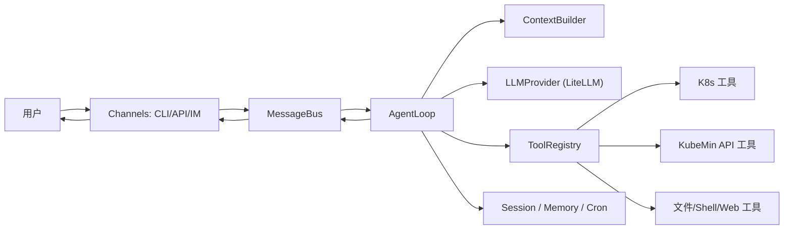

# KubeMin-Agent 设计文档与实现计划

> 基于 nanobot 项目架构，结合 KubeMin 平台场景定制的 AI Agent 设计。

---

## 1. 项目定位与目标

**KubeMin-Agent** 是 KubeMin 平台的 AI Agent 模块，定位为面向云原生应用管理的智能助手。借鉴 nanobot 的轻量级 Agent 架构，为 KubeMin 用户提供：

- **自然语言驱动的 K8s 运维**：通过对话完成资源查询、应用部署、故障诊断
- **工作流智能编排**：Agent 辅助生成和优化 KubeMin Workflow
- **多通道接入**：CLI、API、即时通讯（Telegram/飞书/钉钉）

### 核心差异（对比 nanobot）

| 维度 | nanobot | KubeMin-Agent |
|------|---------|---------------|
| 定位 | 通用个人 AI 助手 | 云原生平台专用 Agent |
| 工具集 | 文件/Shell/Web/消息 | K8s 运维 + KubeMin API + 文件/Shell |
| 安全模型 | 正则拦截 + 工作区限制 | RBAC + Namespace 隔离 + 审计日志 |
| 部署形态 | 单机单进程 | 可嵌入 KubeMin 平台或独立部署 |
| 记忆 | 纯文本文件 | 文本文件 + 未来可扩展向量检索 |

---

## 2. 高层架构

### 2.1 数据流总览



### 2.2 模块划分

```
kubemin_agent/
├── agent/              # 核心 Agent 逻辑
│   ├── loop.py         #    Agent 循环（LLM ↔ 工具执行）
│   ├── context.py      #    上下文装配器
│   ├── memory.py       #    持久记忆
│   ├── skills.py       #    技能加载器
│   ├── subagent.py     #    后台子任务执行
│   └── tools/          #    工具系统
│       ├── base.py     #    Tool 抽象基类
│       ├── registry.py #    工具注册表
│       ├── filesystem.py  # 文件操作工具
│       ├── shell.py    #    命令执行工具
│       ├── web.py      #    Web 搜索/抓取
│       ├── message.py  #    消息发送工具
│       ├── spawn.py    #    子任务工具
│       └── kubectl.py  #    K8s 资源查询工具（新增）
├── providers/          # LLM Provider 抽象
│   ├── base.py         #    LLMProvider / LLMResponse / ToolCallRequest
│   └── litellm_provider.py  # LiteLLM 统一网关
├── bus/                # 消息路由
│   ├── events.py       #    InboundMessage / OutboundMessage
│   └── queue.py        #    MessageBus 异步队列
├── channels/           # 通道接入
│   ├── base.py         #    BaseChannel 抽象
│   ├── manager.py      #    ChannelManager
│   └── telegram.py     #    Telegram 通道（首选）
├── session/            # 会话管理
│   └── manager.py      #    JSONL 持久化
├── config/             # 配置
│   ├── schema.py       #    Pydantic 配置模型
│   └── loader.py       #    配置加载
├── cron/               # 定时任务
│   ├── service.py      #    调度服务
│   └── types.py        #    任务类型定义
├── heartbeat/          # 心跳检测
│   └── service.py      #    主动唤醒
├── skills/             # 内置技能
├── cli/                # CLI 命令
│   └── commands.py     #    Typer 命令定义
└── utils/              # 工具函数
    └── helpers.py
```

---

## 3. 核心模块设计

### 3.1 AgentLoop（核心引擎）

**职责**：
1. 从 `MessageBus` 拉取消息，构建上下文
2. 调用 LLM（支持工具调用）
3. 执行工具，将工具结果回填继续对话
4. 保存会话历史到本地

**关键设计**：
- 工具调用循环限制：`max_iterations` 防止无限循环
- 系统消息路由：`_process_system_message` 处理 subagent 回报
- 工具上下文注入：每次消息处理时注入 channel/chat_id

```python
class AgentLoop:
    def __init__(self, bus, provider, workspace, model=None, max_iterations=20):
        self.bus = bus
        self.provider = provider
        self.context = ContextBuilder(workspace)
        self.tools = ToolRegistry()
        self.sessions = SessionManager(workspace)
        self._register_default_tools()

    async def run(self):
        """主循环：消费消息 → 处理 → 发送响应"""

    async def _process_message(self, msg: InboundMessage) -> str | None:
        """单条消息处理：构建上下文 → LLM → 工具循环 → 回送"""

    async def process_direct(self, content: str, session_key="cli:direct") -> str:
        """CLI 直接调用入口"""
```

### 3.2 Tool 系统

**Tool 抽象基类**：

```python
class Tool(ABC):
    @property
    @abstractmethod
    def name(self) -> str: ...

    @property
    @abstractmethod
    def description(self) -> str: ...

    @property
    @abstractmethod
    def parameters(self) -> dict[str, Any]: ...  # JSON Schema

    @abstractmethod
    async def execute(self, **kwargs) -> str: ...

    def validate_params(self, params) -> list[str]: ...
    def to_schema(self) -> dict: ...  # OpenAI function 格式
```

**ToolRegistry**：
- 统一注册、校验、执行
- 错误自动包装，参数校验返回具体字段

**KubeMin 专有工具（新增）**：

| 工具 | 用途 | 安全约束 |
|------|------|----------|
| `kubectl_tool` | K8s 资源查询 | 仅只读命令 + Namespace 限制 |
| `kubemin_api_tool` | KubeMin API 调用 | RBAC 权限检查 |
| `workflow_tool` | 工作流操作 | 操作审计日志 |

### 3.3 LLMProvider 抽象

```python
class LLMProvider(ABC):
    async def chat(self, messages, tools=None, model=None,
                   max_tokens=4096, temperature=0.7) -> LLMResponse: ...
    def get_default_model(self) -> str: ...

@dataclass
class LLMResponse:
    content: str | None
    tool_calls: list[ToolCallRequest]
    finish_reason: str = "stop"
    usage: dict[str, int]
```

**实现**：通过 LiteLLM 作为统一网关，支持 OpenRouter/Anthropic/OpenAI/Gemini/vLLM 等。

### 3.4 MessageBus（消息路由）

```python
class MessageBus:
    async def publish_inbound(self, msg: InboundMessage): ...
    async def consume_inbound(self) -> InboundMessage: ...
    async def publish_outbound(self, msg: OutboundMessage): ...
    def subscribe_outbound(self, channel, callback): ...
    async def dispatch_outbound(self): ...
```

解耦 Channel 与 Agent：Channel 只负责接入和格式转换，通过 Bus 与 Agent 通信。

### 3.5 Session / Memory / ContextBuilder

- **SessionManager**: JSONL 持久化到 `~/.kubemin-agent/sessions/`，key = `channel:chat_id`
- **MemoryStore**: `memory/MEMORY.md`（长期）+ `memory/YYYY-MM-DD.md`（每日），纯文件存储
- **ContextBuilder**: 拼装 identity + bootstrap + memory + skills + history → 系统提示词

### 3.6 配置模型

使用 Pydantic Settings，支持配置文件 + 环境变量：

```python
class Config(BaseSettings):
    agents: AgentsConfig          # model、max_tokens、temperature
    providers: ProvidersConfig    # 各 LLM provider 的 apiKey/apiBase
    channels: ChannelsConfig      # Telegram/其他通道开关与凭证
    tools: ToolsConfig            # 工具特定配置（exec timeout 等）
    gateway: GatewayConfig        # 网关 host/port
    kubemin: KubeMinConfig        # KubeMin API 地址、认证（新增）
```

---

## 4. 安全基线

| 措施 | 说明 |
|------|------|
| 命令执行最小权限 | 默认仅允许工作区内执行，跨目录需显式开启 |
| 高危操作拦截 | 正则匹配危险命令模式并记录审计日志 |
| K8s 只读限制 | kubectl 工具仅允许 get/describe/logs，禁止 apply/delete |
| Namespace 隔离 | K8s 工具限制在指定 namespace 内操作 |
| Secrets 管理 | API Key 仅从配置或环境变量读取，不写入会话和日志 |
| 输入输出边界 | 限制工具输出长度，防止上下文爆炸 |
| 操作审计 | 所有工具调用记录到审计日志 |

---

## 5. 分阶段实现计划（8 周）

### M0（第 1 周）：项目骨架与运行底座

**交付物**：目录结构、配置模型、CLI 框架、日志系统

**任务包**：
- 建立完整目录结构（`config/` `providers/` `agent/` `tools/` `channels/` `cron/` `session/`）
- 配置加载与默认模板生成（`onboard` 命令）
- 统一日志格式（loguru + 可切换 JSON）
- CLI 框架搭建（typer）

**验收**：
- `python -m kubemin_agent agent -m "ping"` 可跑通 mock provider 返回
- `python -m kubemin_agent status` 可输出配置和运行信息

---

### M1（第 2 周）：AgentLoop + Provider + ToolRegistry

**交付物**：完整的工具调用循环

**任务包**：
- 实现 `AgentLoop` 迭代控制与 tool call 回填
- 实现 `LLMProvider` 抽象 + LiteLLM 具体 provider
- 实现 `Tool` 参数校验（JSON Schema）和统一错误包装
- 实现 `ToolRegistry` 注册、查询、执行

**验收**：
- 模型可触发并执行工具调用
- 超过迭代上限时有清晰失败输出
- 工具参数错误可被识别并回传具体字段

---

### M2（第 3 周）：Context / Session / Memory

**交付物**：可恢复会话和基础记忆系统

**任务包**：
- `ContextBuilder` 拼装：identity + bootstrap + memory + history
- `SessionManager` JSONL 存储
- `MemoryStore`（长期 + 每日）读写能力

**验收**：
- 重启后会话可继续
- MEMORY 和当日笔记可进入系统提示词

---

### M3（第 4 周）：核心工具与安全边界

**交付物**：文件、命令、Web 三类基础工具 + K8s 只读工具

**任务包**：
- `read/write/edit/list` 文件工具
- `exec` 工具的黑名单 + 可选工作区限制
- `web_search/web_fetch`（有 key 时启用）
- `kubectl_tool`（只读命令 + namespace 限制）

**验收**：
- 工具参数错误可被识别并回传具体字段
- 高风险命令被拦截并记录审计日志
- K8s 工具可执行 `kubectl get pods` 等只读命令

---

### M4（第 5 周）：Channel 接入与消息路由

**交付物**：CLI + 1 个 IM 通道（Telegram）

**任务包**：
- `BaseChannel`、`ChannelManager`、allowlist 机制
- 平台消息格式转换（markdown → 平台格式）
- 媒体消息最小支持（文本+图片）

**验收**：
- IM 收到消息后可触发 Agent 并回发
- 未授权用户被拒绝且不入队

---

### M5（第 6 周）：Cron + Heartbeat + 子任务

**交付物**：长期运行能力

**任务包**：
- Cron 服务（`every/cron/at`）及 CLI 管理命令
- Heartbeat 周期触发读取任务文件
- Subagent（`spawn`）异步执行并回报主会话

**验收**：
- 可新增、执行、删除定时任务
- 子任务完成后能回主会话并生成自然语言摘要

---

### M6（第 7 周）：稳定性与可观测性

**交付物**：面向生产的稳定性基线

**任务包**：
- 错误分级与重试策略（网络、限流、通道断连）
- 关键指标埋点（请求数、失败数、平均耗时、队列长度）
- 运行手册与故障排查文档

**验收**：
- 注入故障后系统可恢复，不丢关键状态
- 能定位单次失败路径（request id + session key）

---

### M7（第 8 周）：发布准备与扩展接口

**交付物**：v1.0 发布包和后续扩展位

**任务包**：
- 打包与容器化（Docker）
- 回归测试与性能抽样测试
- 扩展规范文档（如何新增 Tool/Channel/Skill）

**验收**：
- 提供一键启动说明
- 发布清单包含已知问题和回滚策略

---

## 6. 任务分解（Backlog 模板）

| ID | 模块 | 优先级 | 估时 | 前置依赖 | 验收标准 |
|---|---|---|---|---|---|
| KA-001 | Provider 抽象 | P0 | 1d | 无 | 至少 1 个 provider 可跑通 |
| KA-002 | AgentLoop 工具循环 | P0 | 2d | KA-001 | 工具调用闭环可用 |
| KA-003 | Tool 参数校验 | P0 | 1d | KA-002 | 错参可定位到字段 |
| KA-004 | Session 持久化 | P0 | 1d | KA-002 | 重启可恢复最近 50 条 |
| KA-005 | Exec 安全拦截 | P0 | 1d | KA-003 | 危险命令拦截并记录 |
| KA-006 | Kubectl 只读工具 | P0 | 2d | KA-003 | K8s 只读查询可用 |
| KA-007 | Telegram 通道 | P1 | 2d | KA-002 | IM 收发消息成功 |
| KA-008 | Cron 服务 | P1 | 2d | KA-004 | 定时触发 agent turn |
| KA-009 | Heartbeat 服务 | P1 | 1d | KA-004 | 空任务不触发执行 |
| KA-010 | Spawn 子任务 | P2 | 2d | KA-002 | 异步完成并回报 |
| KA-011 | 指标与告警 | P2 | 2d | KA-007, KA-008 | 能定位失败原因 |
| KA-012 | KubeMin API 工具 | P1 | 2d | KA-003 | 可调用 KubeMin API |

---

## 7. 测试策略与 CI 门禁

**测试层次**：
- **单元测试**: `tools`、`provider parser`、`cron schedule`、`session load/save`
- **集成测试**: `AgentLoop + ToolRegistry + mock provider`
- **端到端测试**: CLI 一条指令触发完整链路
- **稳定性测试**: 长时间运行与断网重连场景

**CI 最低门禁**：
- `ruff` / `mypy` / `pytest` 全通过
- 核心模块覆盖率阈值 ≥ 70%
- 关键 e2e 用例必须通过（对话、工具调用、定时任务）

---

## 8. 技术选型

| 用途 | 技术选型 | 理由 |
|------|----------|------|
| Python 版本 | ≥ 3.11 | 原生 async 支持、类型标注增强 |
| CLI 框架 | typer | 轻量、自动生成帮助文档 |
| LLM 网关 | litellm | 统一接口、支持多 provider |
| 配置管理 | pydantic + pydantic-settings | 类型安全、支持环境变量 |
| HTTP 客户端 | httpx | 原生 async、性能优秀 |
| 日志 | loguru | 简洁 API、结构化输出 |
| 定时调度 | croniter | 标准 cron 表达式解析 |
| 终端输出 | rich | 美观的终端渲染 |
| 构建系统 | hatchling | 现代 Python 打包标准 |

---

## 9. 两周冲刺执行清单

**Sprint 1（第 1-2 周）**：
- 完成 M0 + M1
- 产出最小闭环：CLI 对话 + 工具调用 + 错误处理

**Sprint 2（第 3-4 周）**：
- 完成 M2 + M3
- 产出可持续上下文：会话持久化 + 记忆 + 基础安全工具集 + K8s 工具

**每个 Sprint 固定节奏**：
- Day 1：拆任务和风险评审
- Day 2-4：实现与单测
- Day 5：集成测试和缺陷修复
- Day 6：文档更新与演示

---

## 10. 当前决策建议

为了避免计划空转，优先锁定三项：

1. **第一通道**: `Telegram`（复杂度和文档成熟度最佳）
2. **Provider**: `LiteLLM + OpenRouter`（兼容性最好）
3. **部署**: `单机 Docker`（先稳定，再考虑嵌入 KubeMin 平台）

锁定后即可按 Sprint 1 开工。
